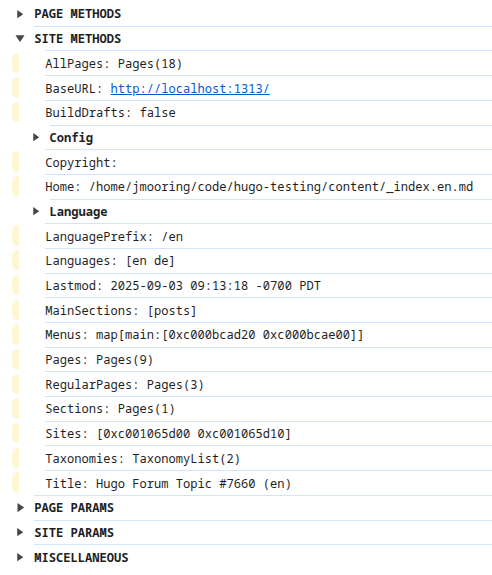

# Hugo Module &ndash; Debug

This Hugo module displays debug information in the browser console including:

- Output from the available Page methods
- Output from the available Site methods
- Page parameters
- Site parameters
- Miscellaneous information

Requires Hugo v0.146.0 or later.



## Configuration

To add this module to your project, initialize your project as a Hugo module:

```sh
hugo mod init foo
```

In the above, `foo` is typically something like `github.com/user/project`.

Then add this to your site configuration:

```toml
[[module.imports]]
path = 'github.com/jmooring/hugo-module-debug'
```

## Usage

Place this template code within the `head` element of your base template:

```text
{{ if hugo.IsDevelopment }}
  {{ partial "debug.html" . }}
{{ end }}
```

Then run `hugo server` and view the browser console.

## Try it

```text
git clone --single-branch -b hugo-forum-topic-7660 https://github.com/jmooring/hugo-testing hugo-forum-topic-7660
cd hugo-forum-topic-7660
hugo server
```
